# Trio — Money + Split + Hours, in one app

> ⚡ **Built in a ~12-hour window** as an interview challenge — *"Can you build an app using AI, and how long would you need?"* — using Flutter + Supabase with an AI pair-programmer (Claude Code). The hard part wasn't the typing; it was the architecture, data modeling, security (Row-Level-Security), and reviewing every change.


A free, cross-platform (Android/iOS) personal app bundling three trackers:

- **Money** — multiple accounts, income/expense/transfers, custom categories, budgets,
  recurring transactions, spending charts, CSV export.
- **Split** — Splitwise-style shared expenses: groups, members, equal/exact/%/shares
  splitting, simplified "who owes whom", settle-up, realtime sync across members.
- **Hours** — projects with hourly rates, a live start/stop timer, manual entries,
  timesheets, and billable earnings reports.

Built with **Flutter** + **Riverpod** + **go_router**, backed by a free **Supabase**
project (Postgres + Auth + Realtime, all protected by Row Level Security).

---

## Screenshots

**Dashboard & Money**

<p align="center">
  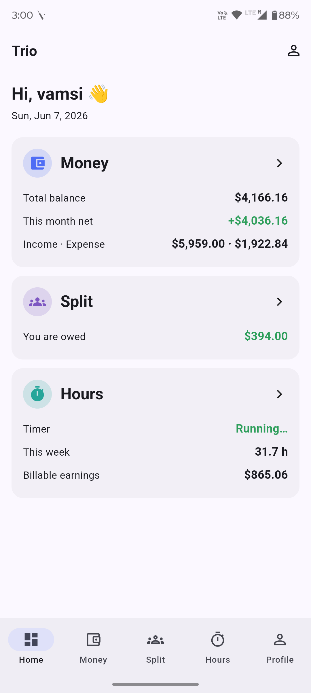
  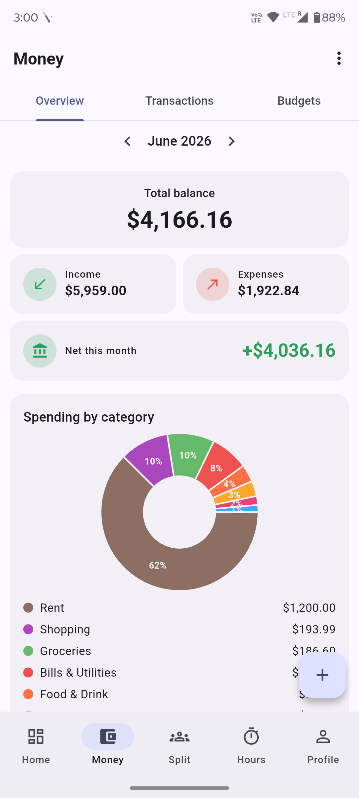
  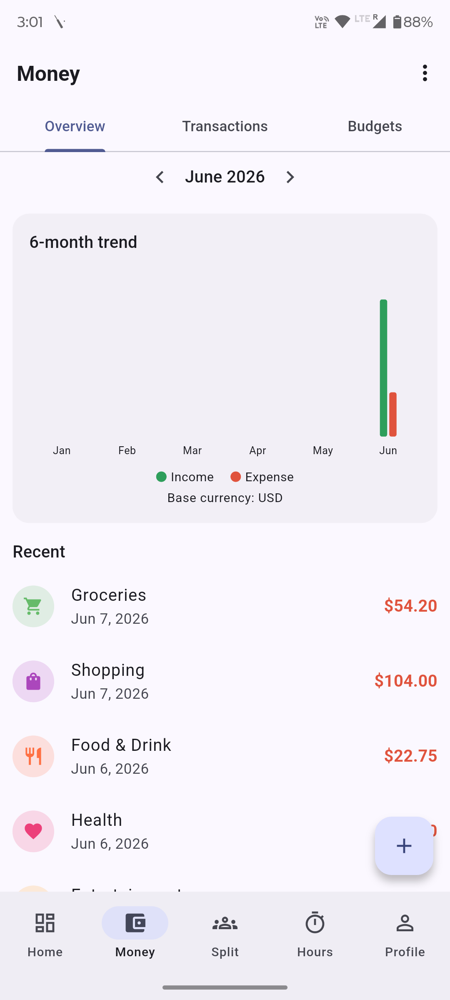
  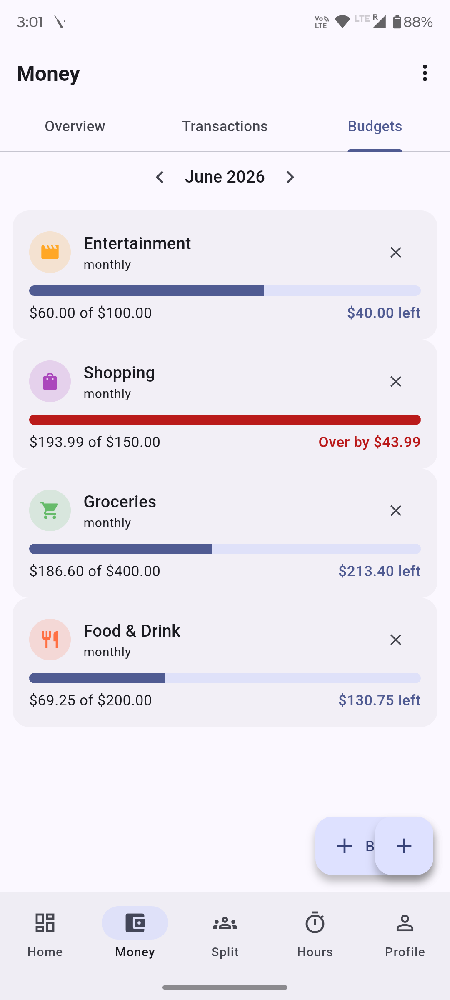
</p>

**Split (shared expenses)**

<p align="center">
  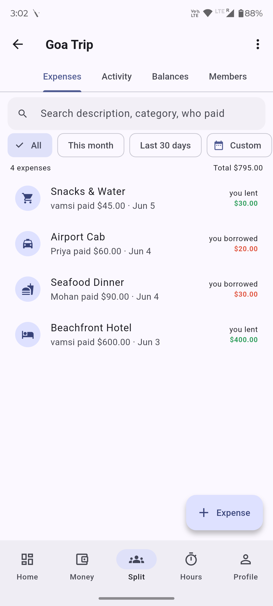
  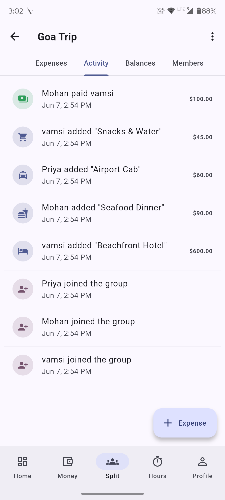
  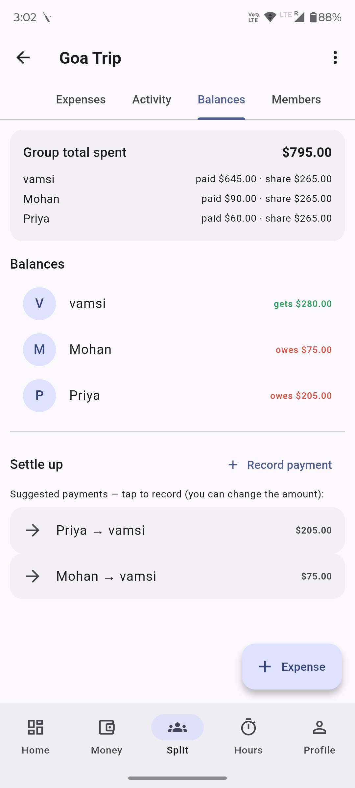
</p>

**Hours & Profile**

<p align="center">
  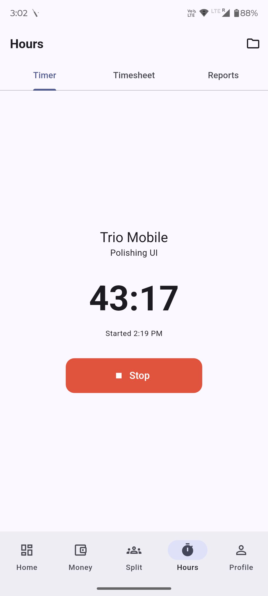
  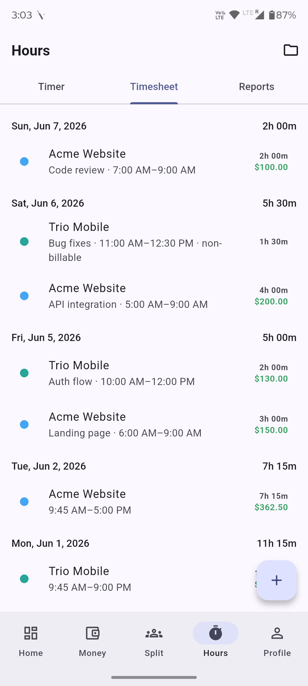
  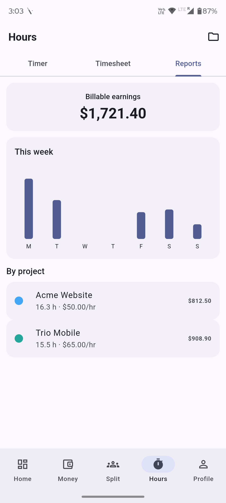
  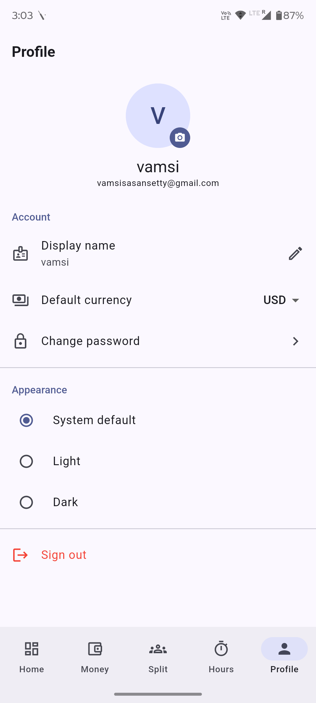
</p>

---

## One-time setup

### 1. Backend (Supabase, free)
Follow [`supabase/README.md`](supabase/README.md): create a free project, run
`schema.sql` → `policies.sql` → `seed.sql` in the SQL editor, then copy your Project URL
and anon key.

### 2. Credentials
```bash
cp .env.example .env
# edit .env and paste SUPABASE_URL and SUPABASE_ANON_KEY
```
Credentials are passed at build time via `--dart-define` (never committed). The anon key
is safe in a client app — RLS is what protects the data.

### 3. Toolchain
Requires the Flutter SDK + Android SDK (already installed on this machine; `flutter doctor`
should show the Android toolchain ✓). For iOS you also need Xcode (deferred for now).

---

## Run it

```bash
./run.sh                 # pick a device interactively
./run.sh chrome          # quick UI check in the browser
./run.sh emulator-5554   # a specific device/emulator id
```

`flutter devices` lists available targets.

## Build a release APK (free, sideload)

```bash
./build_apk.sh
# → build/app/outputs/flutter-apk/app-release.apk
adb install -r build/app/outputs/flutter-apk/app-release.apk   # to a connected phone
```
Or copy the APK to an Android phone and open it (enable "install unknown apps" once).

## iOS (later)
Install Xcode + CocoaPods, then `open ios/Runner.xcworkspace`, set a free Apple ID signing
team, and run to your device. Free certs require re-signing every 7 days.

---

## Project layout
```
lib/
  core/                 config, theme, formatters, constants, shared widgets, Supabase
  router/               go_router with auth guard + bottom-nav shell
  features/
    auth/               sign in / sign up
    dashboard/          aggregated home screen
    money/              accounts, categories, transactions, budgets, recurring, reports
    split/              groups, expenses, split_engine (+ unit tests), balances, settle-up
    hours/              projects, live timer, timesheet, reports
    profile/            settings, theme, sign out
supabase/               schema.sql · policies.sql · seed.sql · setup README
tool/generate_icon.py   regenerates assets/icon.png
test/                   split_engine_test.dart (split math + debt simplification)
```

## Tests
```bash
flutter test            # split engine: splitting math, balances, debt simplification
flutter analyze         # static analysis (clean)
```

## Cost
Everything here is **$0**: Flutter, Supabase free tier, and Android APK sideloading.
(App-store distribution would cost Google $25 once / Apple $99 per year — not required.)
